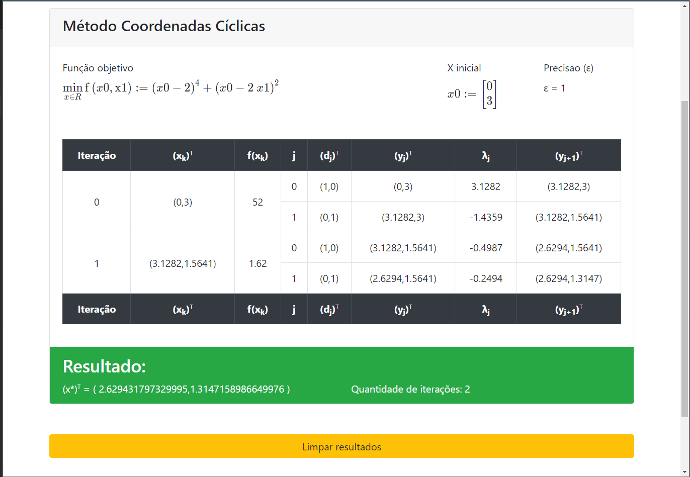
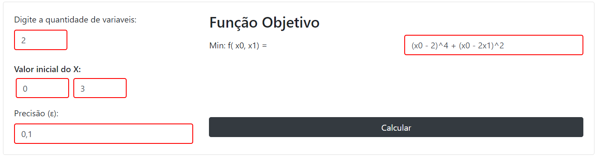
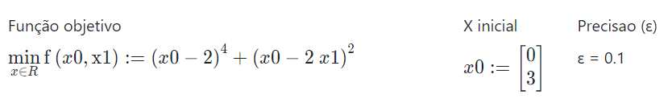

# Segundo Trabalho de Pesquisa Operacional II

<div align="center">
  
</div>

<br />

<div align="center" >

[](https://angular.io/)
[](https://www.typescriptlang.org/)
[](https://getbootstrap.com/)

</div>


## Sobre o projeto 

Este é o segundo trabalho desenvolvido na matéria de Pesquisa Operacional II
do 5º termo do curso de Bacharel em Ciência da Computação (BCC) da
UNESP "Julio de Mesquita Filho" do campus de Bauru, ministrada pela
professora Dra. Marcia A. Zanoli Meira e Silva.

O objetivo do projeto é disponibilizar alguns métodos de Programação não Linear para Otimização Multivariável Irrestrita. 

## Métodos de otimização 
Segue a lista de métodos de Programação Não Linear de Multivariáveis Irrestritas disponibilzados nesse projeto:

- Coordenadas Cíclicas;
- Hooke and Jeeves;
- Gradiente;
- Newton;
- Gradiente Conjugado Generalizado;
- Fletcher and Reeves;

### Exemplo de otimização 

<div align="center">
  
</div>

<br />

- Quantidade de variaveis: 2
- Valor Inicial do X: 0, 3
- Precisão: 0,1 
- Função: (x0 - 2)^4 + (x0 - 2x1)^2 

<div align="center">
  
</div>


## 💻 Pré-requisitos

Pra rodar o projeto na máquina é possível utilizar: 

- Versão do node: `10.24.1`

## Rodar na máquina 

```
git clone https://github.com/leonardooliveira42/T2-POII
cd T2-POII 
```

Para instalar as dependencias
```
npm install 
```

Pra rodar localmente
```
npm run start
```